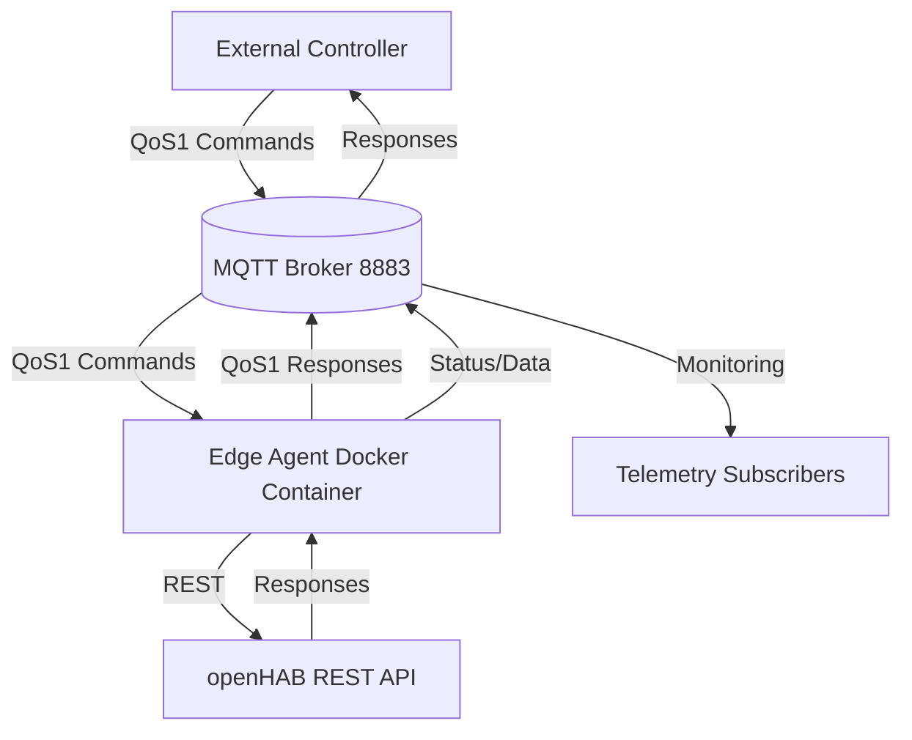
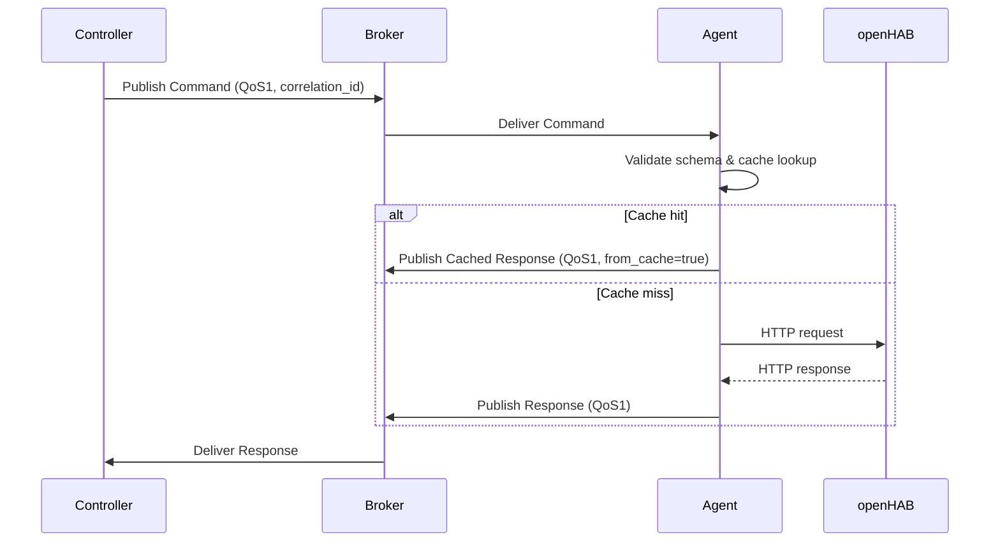
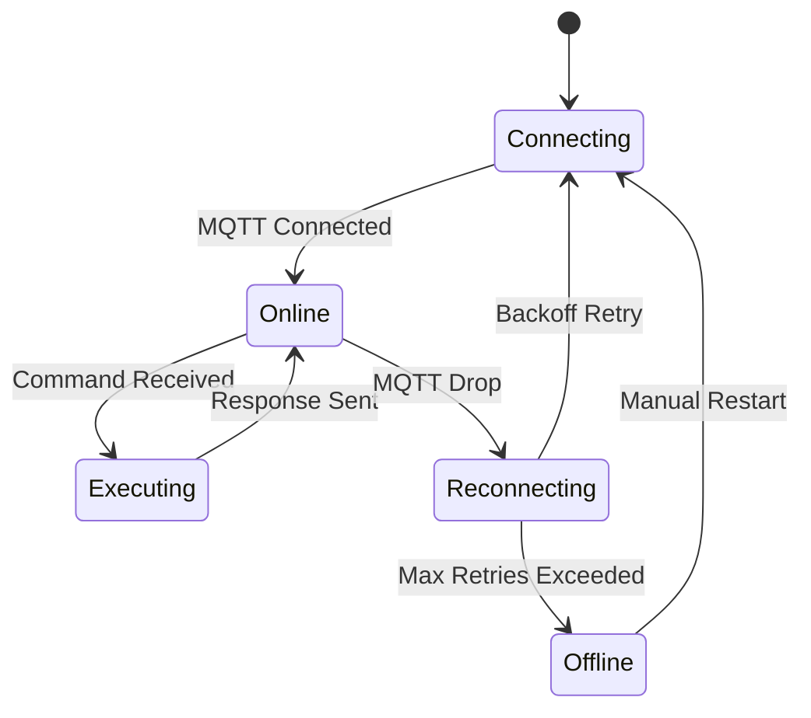
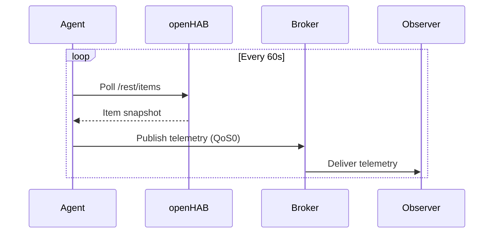
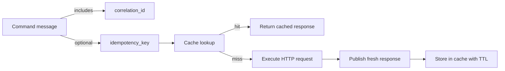

# Edge Agent Overview

The edge agent bridges cloud-initiated MQTT commands to the local openHAB REST API, enabling secure, correlated responses without exposing the automation system to the public internet.

## Deployment

## Command Lifecycle

## State Machine

## Telemetry Flow

## Correlation & Idempotency

